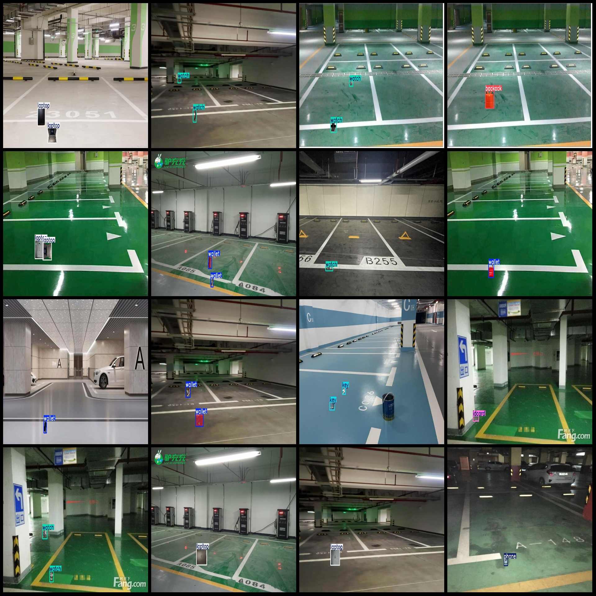

# Lost and Leftover Objects Detection Dataset for Underground Parking Spaces in VOC+YOLO format with 7 classes

dataset format: Pascal VOC format+YOLO format
number of images: 700  
700
Number of files (.txt): 700
annotationnumber of classes: 7  
["backack","idcard","key","laptop","phone","wallet","watch"]
boxes per class:   
backack box count = 151
idcard box count = 148
Key (key) Frames = 149
Laptop frame count = 151
Phone (phone) Box Count = 145  
Wallet (wallet) Frame Number = 152
Watch frame count = 153
total boxes: 1049  
Image resolution: 1920x1080
Use the labeling tool: labelImg
Annotation Rules: Draw a rectangle around the category.
Important notes: None.
Special Statement: This dataset does not guarantee the accuracy of the trained model or weight files.
Image preview:
## Images

Here is a pay link on Stripe ( https://buy.stripe.com/3cs8yP7sY87d0vu9AB ). Please contact me lonlonago@foxmail.com after funding $89, and I will send you a complete data files , thank you!

